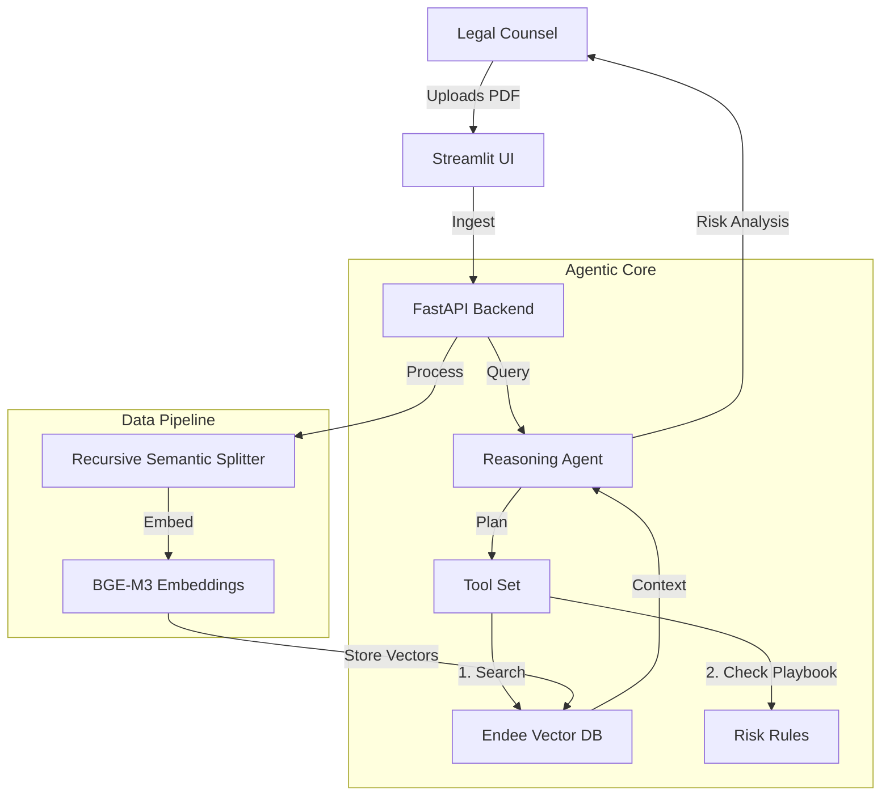

# ⚖️ ContractSentinel: Agentic Legal Risk Assistant


**ContractSentinel** is an autonomous AI agent designed to revolutionize legal contract review. Unlike simple keyword searches or basic RAG chatbots, ContractSentinel uses **Agentic Reasoning** backed by the **Endee Vector Database** to semantically understand, retrieve, and analyze high-risk clauses in legal documents.

---

## 🚀 Problem Statement

Legal teams spend thousands of hours manually reviewing NDAs, MSAs, and Service Agreements. Missing a single "unilateral indemnification" clause can cost a company millions. 

**The Challenge:** Standard search fails to find concepts like "termination for convenience" if the specific words aren't used. Simple RAG often hallucinates or retrieves irrelevant context.

**The Solution:** ContractSentinel uses **Endee's High-Recall Vector Engine** to guarantee critical clause retrieval, and an **Agentic State Machine** to reason about risks just like a human lawyer would (e.g., *Check Liability -> Check Indemnification -> Compare with Playbook*).

---

## 🏗️ System Architecture



### 🔧 Tech Stack

- **Vector Database:** [Endee](https://github.com/endeelabs/endee) (High-Performance, Low-Memory)
- **Agent Framework:** Custom ReAct State Machine (Python)
- **Backend:** FastAPI, Pydantic
- **Frontend:** Streamlit
- **Embeddings:** BAAI/bge-m3 (via SentenceTransformers)
- **LLM:** Integration ready for Llama 3 (Ollama) or OpenAI GPT-4.

---

## 🏃‍♂️ How to Run

### Prerequisities
- Docker & Docker Compose
- Python 3.10+ (if running locally without Docker)

### 1. Clone & Configure
```bash
git clone https://github.com/yourusername/ContractSentinel.git
cd ContractSentinel
cp .env.example .env
```
*Note: Ensure the `image` name in `docker-compose.yml` matches the official Endee Labs image if it has changed recently.*

### 2. Run with Docker (Recommended)
```bash
docker-compose up --build
```
This will start:
- **Endee Vector DB** at `localhost:8080`
- **Backend API** at `localhost:8000`
- **Frontend UI** at `localhost:8501`

### 3. Usage
1. Open `http://localhost:8501`.
2. Upload a sample PDF Contract (e.g., standard NDA).
3. Click **Ingest Document**.
4. Ask: *"Does this contract have mutual indemnification?"* or *"What is the liability cap?"*

---

## 🧠 Why Endee Vector Database?

For legal AI, **Recall is King**. 
- **Standard DBs (Pinecone/Milvus):** Often trade recall for speed (Approximate Nearest Neighbors - ANN). Missing a legal clause is not an option.
- **Endee:** Uses a proprietary **Vector Graph Engine (VGE)** that optimizes for highly accurate retrieval while maintaining low latency. It is also significantly more memory-efficient (`~1/10th` footprint of others), making it ideal for on-premise deployment where legal data privacy is paramount.

---

## 🔮 Future Enhancements
- **GraphRAG:** Integrate Knowledge Graphs to track entity relationships (e.g., "Company A" is a subsidiary of "Company B").
- **Multi-Modal:** Process scanned images and tables using VLM (Vision Language Models).
- **CI/CD for Contracts:** Automatically flag risks in GitHub Pull Requests for legal text.
