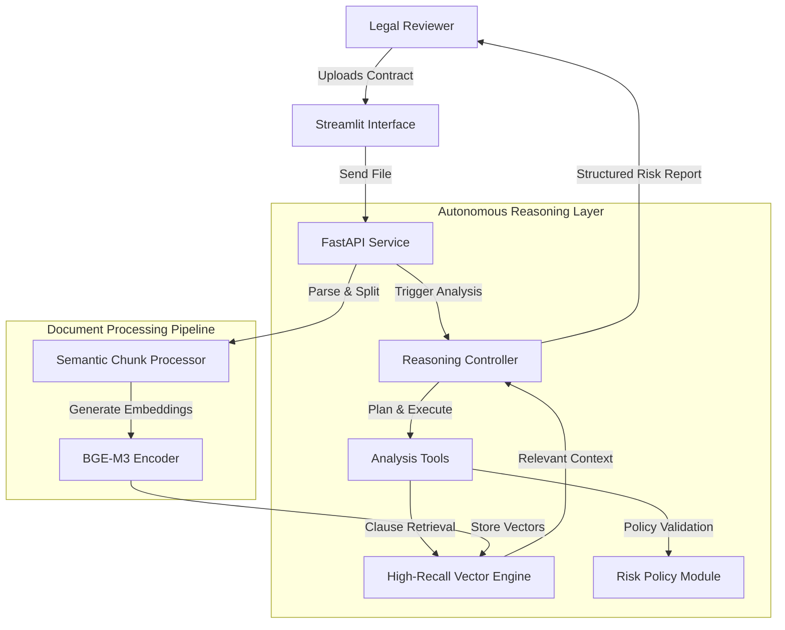

# ⚖️ ClauseGuard AI: Autonomous Legal Risk Intelligence Platform

  

**ClauseGuard AI** is an autonomous contract analysis agent built to modernize legal document review. Rather than relying on surface-level keyword search or generic RAG pipelines, ClauseGuard applies **multi-step agent reasoning** combined with a **high-recall vector engine** to deeply interpret, retrieve, and evaluate legally sensitive clauses.

---

## 🚀 Problem Overview

Legal professionals invest extensive time reviewing NDAs, MSAs, SaaS agreements, and vendor contracts. A single overlooked clause — such as disproportionate indemnification or unlimited liability — can expose organizations to major financial and legal risks.

### 🔎 The Core Issue

* Traditional keyword search misses conceptually similar clauses when wording differs.
* Many RAG-based systems retrieve loosely relevant passages or hallucinate interpretations.
* Approximate search techniques may sacrifice recall — unacceptable in legal contexts.

### 💡 The Approach

ClauseGuard AI ensures:

* **High-fidelity semantic retrieval** for critical legal concepts
* **Stepwise reasoning workflows** (e.g., Liability → Indemnity → Termination → Compare to Policy)
* **Policy-driven risk scoring** aligned with internal legal playbooks

---

## 🏗️ System Architecture



---

## 🔧 Technology Stack

* **Vector Retrieval Engine:** High-Recall Vector Graph Engine
* **Reasoning Framework:** Custom ReAct-style State Machine (Python)
* **Backend API:** FastAPI + Pydantic
* **Frontend Interface:** Streamlit
* **Embeddings Model:** BAAI/bge-m3 (SentenceTransformers)
* **LLM Compatibility:** OpenAI GPT-4 or Llama 3 (via Ollama)

---

## 🏃‍♂️ Setup & Execution

### 📌 Requirements

* Docker & Docker Compose
* Python 3.10+ (if running without containers)

---

### 1️⃣ Clone and Configure

```bash
git clone https://github.com/yourusername/ClauseGuard-AI.git
cd ClauseGuard-AI
cp .env.example .env
```

> Ensure the vector engine image in `docker-compose.yml` matches the latest official build if updates were released.

---

### 2️⃣ Launch via Docker (Recommended)

```bash
docker-compose up --build
```

This will initialize:

* **Vector Engine** → [http://localhost:8080](http://localhost:8080)
* **Backend API** → [http://localhost:8000](http://localhost:8000)
* **Frontend Dashboard** → [http://localhost:8501](http://localhost:8501)

---

### 3️⃣ How to Use

1. Open [http://localhost:8501](http://localhost:8501)
2. Upload a contract document (e.g., NDA or MSA)
3. Click **Process Document**
4. Ask questions such as:

   * “Is indemnification mutual?”
   * “What are the liability limitations?”
   * “Does this agreement allow termination without cause?”

---

## 🧠 Why a High-Recall Vector Engine?

In legal review systems, **missing information is worse than slow retrieval**.

* Many databases prioritize speed using Approximate Nearest Neighbor (ANN) methods.
* Legal AI requires maximum recall to ensure no relevant clause is overlooked.
* A vector graph-based retrieval approach enhances semantic coverage while remaining memory-efficient — making it suitable for private, on-premise deployments where data sensitivity is critical.

---

## 🔮 Planned Enhancements

* **Graph-Augmented Retrieval (GraphRAG):** Track relationships across entities, subsidiaries, and obligations.
* **Vision Integration:** Extract clauses from scanned contracts and embedded tables using VLMs.
* **Continuous Contract Monitoring:** Automatically evaluate legal text changes in version control systems.
* **Comparative Clause Benchmarking:** Compare uploaded contracts against historical agreements.

---

ClauseGuard AI aims to function not merely as a search assistant — but as a structured legal reasoning partner that helps reduce contractual risk before it becomes a liability.
